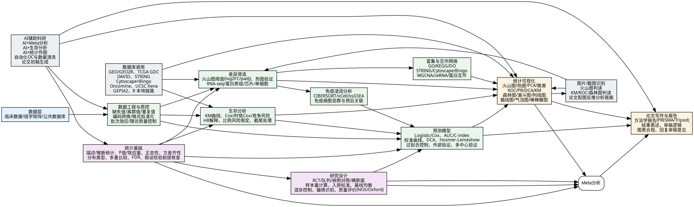

# 解螺旋临床科研文章库分类脑图

基于 613 篇全量正文读取后的主题聚类结果。

## 聚类分布

| 聚类 | 文章数 | 说明 |
|------|--------|------|
| 统计方法与检验 | 176 | t检验/方差分析/非参/卡方/回归/相关/多重比较/FDR |
| 临床研究设计 | 92 | RCT/队列/病例对照/横断面/样本量/基线/混杂/偏倚 |
| Meta分析 | 57 | PRISMA/森林图/漏斗图/异质性/敏感性分析/Egger/Begg |
| 生存分析 | 55 | KM/Cox/时依Cox/竞争风险/HR/截尾 |
| 富集与互作网络 | 41 | GO/KEGG/STRING/Cytoscape/WGCNA/ceRNA/PPI |
| 预测模型 | 36 | 列线图/AUC/C-index/DCA/校准/外部验证 |
| 数据工程与质控 | 28 | 缺失值/离群值/编码/标准化/批次效应/随访QC |
| 统计可视化 | 22 | 火山图/热图/PCA/ROC/KM/森林图/列线图/箱线图 |
| 论文写作与报告 | 17 | PRISMA/Tripod/方法学报告/审稿回复/图表合规 |
| AI辅助科研 | 10 | AI+Meta/AI+生存/AI+作图/自动化QC |
| 组学网络分析 | 8 | WGCNA/共表达/蛋白互作/ceRNA |
| 空间与单细胞组学 | 1 | 空间转录/单细胞测序 |
| 基因注释与ID转换 | 1 | 探针/Ensembl/symbol转换 |
| 生物标志物与诊断 | 1 | LASSO/随机森林/SVM/特征选择 |
| 其他/综合 | 68 | 未明确归类或跨类别综合 |

## 知识脑图 DOT

## 技能仓库映射

当前 `medical-data-mining` 技能仓库覆盖情况：

| 脑图节点 | 对应技能 | 覆盖状态 |
|----------|----------|----------|
| 统计基础 | statistical-thinking | ✅ 已覆盖 |
| 研究设计 | clinical-prediction-model / meta-analysis-bias | ✅ 已覆盖 |
| 差异筛选 | differential-gene-screening / geo-deg-analysis | ✅ 已覆盖 |
| 生存分析 | tcga-survival | ✅ 已覆盖 |
| 预测模型 | clinical-prediction-model | ✅ 已覆盖 |
| 富集互作 | enrichment-analysis / ppi-network | ✅ 已覆盖 |
| 免疫浸润 | （待补充） | ⚠️ 部分覆盖 |
| 数据工程 | clinical-data-engineering | ✅ 已覆盖 |
| 可视化 | biomedical-visualization / visualization | ✅ 已覆盖 |
| 论文写作 | （待补充） | ⚠️ 部分覆盖 |
| 数据库调用 | references/databases-and-vision.md | ✅ 底座已覆盖 |
| 图片识别 | references/databases-and-vision.md | ✅ 底座已覆盖 |
| AI辅助 | ai-assisted-research | ✅ 已覆盖 |

## 建议扩展

基于 613 篇文章聚类，建议新增：
1. `sample-size-calculation` — 样本量计算与把握度（58篇）
2. `bias-quality-control` — 偏倚控制与质量评价（6篇+Meta质量评价）
3. `immune-infiltration` — 免疫浸润分析（CIBERSORT/xCell/ssGSEA）
